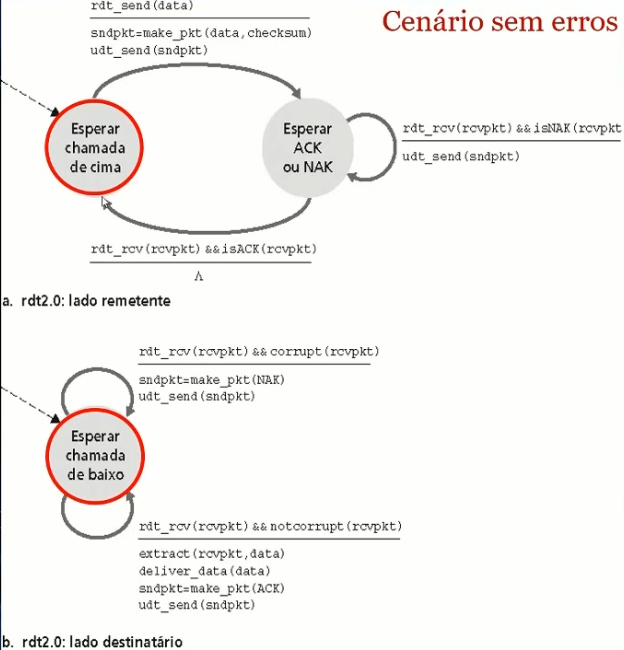
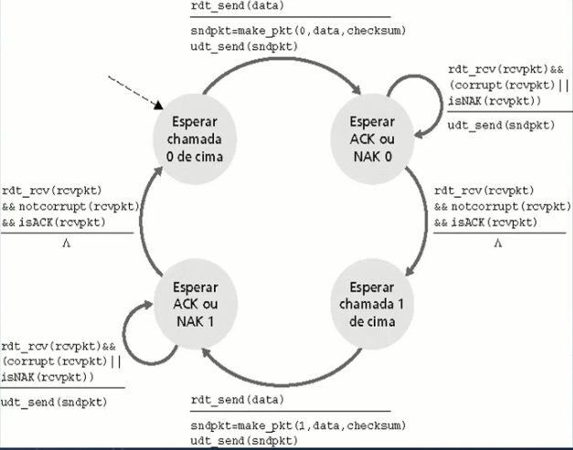
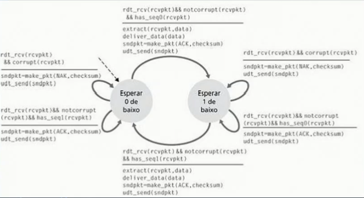
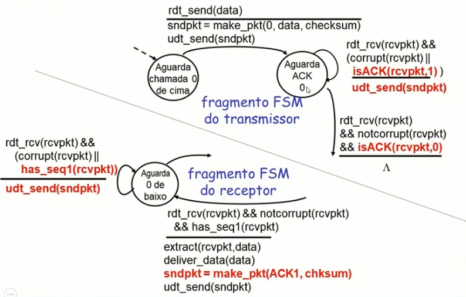
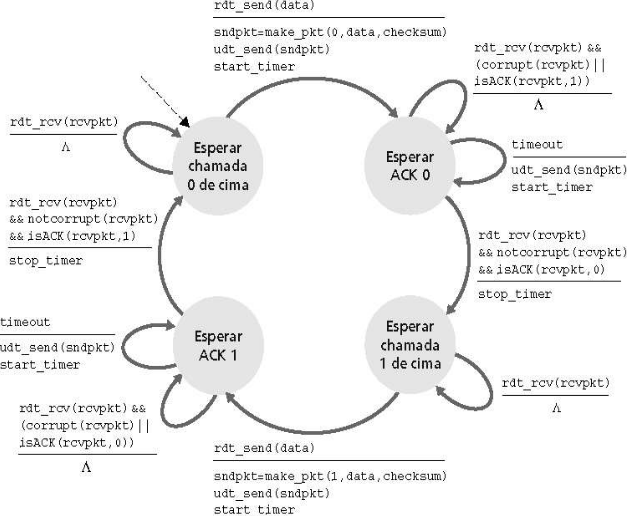
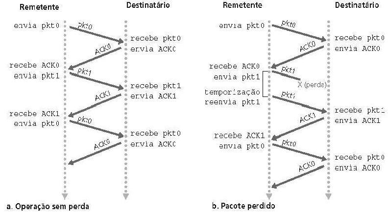
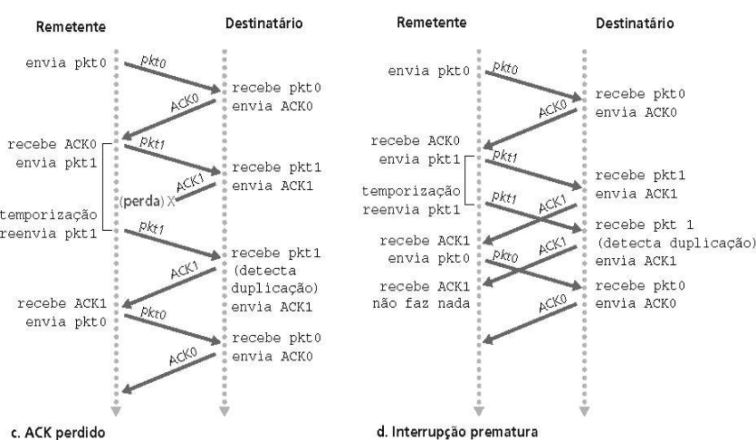

# Videoaula 3 do Capítulo 5: Transferência confiável de dados

- Importante nas camadas de aplicação, transporte e enlace

- Top 10 na lista dos tópicas mais importantes de redes

- Características dos canais não confiáveis determinarão a complexidade dos protocolos confiáveis de transferência de dados

## Transferência confiável: o ponto de partida

Lado emissor:

1. rdt_send(): chamada da camada superior, (ex., pela aplicação). Passa dados para entregar à camada superior receptora

2. udt_send(): chamada pela entidade de transporte, para transferir pacotes para o receptor sobre o canal não confiável

Lado receptor:

1. rdt_rcv(): chamada quando o pacote chega ao lado receptor do canal

2. deliver_data(): chamada pela entidade de transporte para entregar dados para cima

Ordem: rdt_send()->protocolo->udt_send()->**Canal não confiável**->rdt_rcv()->protocolo->deliver_data()

protocolo: protocolo de transferência confiável de dados. Possui um lado remetente e um lado destinatário

### Estudo incremental de mecanismos para prover confiabilidade na transmissão de dados

- Veremos algumas versões de um protocolo confiável (rdt)
- Consideraremos apenas transferências de dados unidirecionais
  - Mas informação de controle deve fluir em ambas as direções!
- Usaremos máquinas de estados finitos (FSM) para especificar o protocolo transmissor e o receptor

## rdt1.0: Transferência confiável sobre canais confiáveis

- Canal de transmissão perfeitamente confiável
  - Não há erros de bits
  - Não há perdas de pacotes
  - Seria o serviço ofecido pelo TCP aos protocolos de aplicação (p.e., HTTP)

- FSMs separadas para transmissor e receptor
  - Transmissor envia dados para o canal subjacente
  - Receptor lê os dados do canal subjacente

- Canal confia no próximo

Lado remetente FSM:

**(Espera chamada de cima)** --**rdt_send(data)**/packet=make_pkt(data);**udt_send(packet)**--> **(Espera chamada de cima)**

Lado destinatário FSM:

**(Espera chamada de baixo)** --**rdt_rcv(packet)**/extract(packet,data);**deliver_data(data)**--> **(Espera chamada de baixo)**

## rdt2.0: canal com erros de bit

- Canal subjacente pode trocar valores dos bits num pacote
  - Mecanismos de segurança: **Checksum** para detectar erros de bits

- Reconhecimentos (ACKs): receptor avisa explicitamente ao transmissor que o pacote foi recebido corretamente

- Reconhecimentos negativos (NAKs): receptor avisa explicitamente ao transmissor que o pacote tem erros

- **Novos mecanismos** no rdt2.0 (além do rdt1.0)
  - Detecção de erros
  - Retorno do receptor: mensagens de controle (ACK, NAK) rcvr->sender

### Problema fatal do rdt2.0

- O que acontece se o ACK/NAK é corrompido?
  - Assumimos que não há perda de pacote na rede
  - Transmissor não sabe o que aconteceu no receptor!
  - Não pode apenas retransmitir: possível duplicata

- Tratamento de duplicatas
  - Transmissor acrescenta número de sequência em cada pacote
  - Transmissor reenvia o último pacote se ACK/NAK for corrompido
  - Receptor descarta (não passa para a aplicação) pacotes duplicados

- Consideramos o modo transmite e aguarde!!!
  - Transmissor envia um pacote e então espera pela resposta do receptor

### rdt2.1: Transmissor, trata ACK/NAKs perdidos

Sem erros:

T.pkt 0->R.Ack->T.Pkt 1->R.Ack

T: Transmissor

R: Receptor

Com erros:

T.pkt 0->**R.Nack->T.pkt 0**->R.Ack->T.Pkt 1->R.Ack

T.pkt 0->**??->T.pkt 0**->R.Ack->T.Pkt 1->R.Ack

### rdt2.1: Receptor trata ACK/NAKs perdidos

Sem erros:

T.pkt 0->R.Ack->T.Pkt 1->R.Ack

Duplicata:

**T.pkt 0->R.Ack->T.pkt 0**->R.Ack->T.Pkt 1->...

### rdt2.1: Discussão

- Transmissor
  - Adiciona número de sequência ao pacote
  - Dois números (0 e 1) bastam. Por quê?
  - Duas vezes o número de estados: O estado deve “lembrar” se o pacote “corrente” tem número de sequência 0 ou 1

- Receptor
  - Deve verificar se o pacote recebido é duplicado
    - Estado indica se o pacote 0 ou 1 é esperado
  - Nota: receptor não sabe se seu último ACK/NAK foi recebido pelo transmissor

## rdt2.2: um protocolo sem NAK

- Mesma funcionalidade do rdt2.1, usando somente ACKs

- Em vez de enviar NAK, o receptor envia ACK para o último pacote recebido sem erro

- Receptor deve incluir explicitamente o número de sequência do pacote sendo reconhecido

- **ACKs duplicados** no transmissor resultam na mesma ação do NAK: **retransmissão** do pacote corrente

## rdt3.0: canais com erros e perdas

- **Nova hipótese**: canal de transmissão pode também perder pacotes

- Abordagem: transmissor espera um tempo “razoável” pelo ACK
  - Retransmite se nenhum ACK for recebido nesse tempo
  - Se o pacote (ou ACK) estiver apenas atrasado (não perdido)
    - Retransmissão será duplicata, mas os números de sequência já tratam com isso

- Receptor
  - Deve especificar o número de sequência do pacote sendo reconhecido
  - Exige um temporizador decrescente

### FSM do tranmissor rdt3.0

### rdt3.0 em ação

